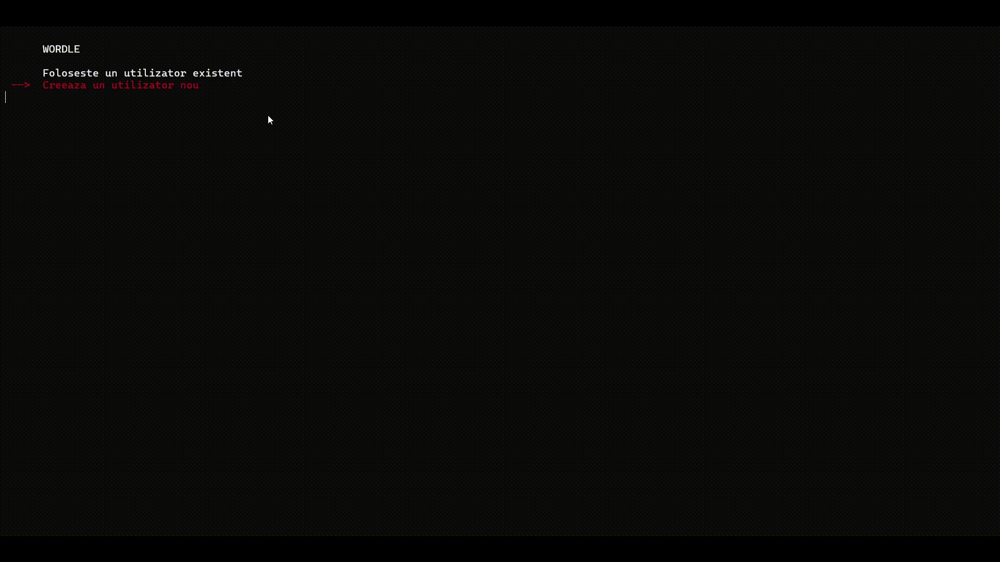

# 🌐 Wordle Romanian Game

## Overview

This is a simple and fun **desktop Wordle-style game** built in **C**. Players can guess words in **Romanian**, following the classic Wordle mechanics. The goal is to provide an easy-to-use and engaging word-guessing experience.

### Why This Project?

This project was built to explore **software architecture** in C while creating a game that is both entertaining and interactive. The focus was on clean **separation between UI and game logic**, making the codebase structured and maintainable.

---

## 🎮 Features

✅ **Simple & Intuitive UI** – Clean and easy-to-use interface for seamless gameplay.\
✅ **Modular Architecture** – Clear separation between **interface** and **game logic**.\
✅ **Unit Tests** – Fully tested game logic for **all possible cases**.

---

## 🎥 Demo



---

## 🛠️ Tech Stack

- **Language**: C
- **Framework**: WinAPI (for UI)
- **Build System**: Visual Studio 2022

---

## 🚀 Installation & Setup

### 1️⃣ Clone the Repository

```sh
 git clone https://github.com/sergiustoicanescu/Wordle.git
 cd Wordle
```

### 2️⃣ Open in Visual Studio 2022

- Open the `Wordle.sln` file.
- Ensure all **header files** and **resource files** are in the correct directories.

### 3️⃣ Build & Run

- Click **Build Solution (**\`\`**)**.
- Run the game and start guessing words!

---

## 🤝 Contributing

1. Fork the repository.
2. Create a new branch (`feature/new-feature`).
3. Commit changes and push.
4. Open a PR!

---

### ✨ Enjoy the Game & Happy Guessing! 🎮

